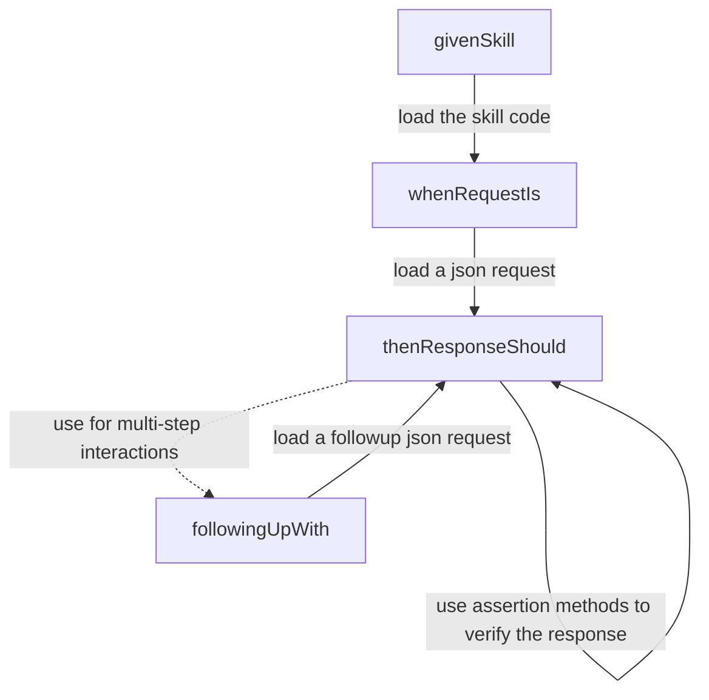

<h1 align="left">
  Testing tools for Java Alexa skills
  <br/>
  <a href="https://search.maven.org/artifact/info.tomfi.alexa/alexa-skills-tester">
    
  </a>
  <a href="https://openjdk.java.net/projects/jdk/11/">
    
  </a>
  <a href="https://javadoc.io/doc/info.tomfi.alexa/alexa-skills-tester">
    
  </a>
  <a href="https://codecov.io/gh/TomerFi/alexa-skills-tester">
    
  </a>
</h1>

<p align="left">
  <strong>Want to test your Alexa skills with real requests?</strong><br/>

  <em>
  No deploying, hosting, or configuring the skill interface is required!<br/>
  All you need is your Java skill and this tool.
  </em>
</p>
<p align="left">



</p>

<p align="left">
  <table align="left">
    <tr>
      <td align="center">
        <a href="https://github.com/TomerFi/alexa-skills-tester/wiki" target="_blank">
          Wiki
        </a>
      </td>
      <td align="center">
        <a href="https://javadoc.io/doc/info.tomfi.alexa/alexa-skills-tester" target="_blank">
          Javadoc
        </a>
      </td>
      <td align="center">
        <a href="https://dev.to/tomerfi/alexa-skills-testing-4pfd" target="_blank">
          Blog
        </a>
      </td>
      <td align="center">
        <a href="https://developer.amazon.com/en-US/docs/alexa/custom-skills/request-and-response-json-reference.html" target="_blank">
          Alexa Ref.
        </a>
      </td>
    </tr>
    <tr>
      <td align="center" colspan="2">
        <a href="https://github.com/TomerFi/alexa-skill-shabbat-times/tree/master/lambda/src/it/shabbat-times-interaction-it/src/test/java/info/tomfi/alexa/shabbattimes/it" target="_blank">
          Example<br/><em>integration test</em>
        </a>
      </td>
      <td align="center" colspan="2">
        <a href="https://github.com/TomerFi/alexa-skill-shabbat-times" target="_blank">
          Example<br/><em>shabbat times skill</em>
        </a>
      </td>
    </tr>
  </table>
</p><br/><br/><br/><br/><br/>

<details>
<summary><strong>Dependency Declaration</strong></summary>
<p>

```xml
<dependency>
  <groupId>info.tomfi.alexa</groupId>
  <artifactId>alexa-skills-tester</artifactId>
  <version>0.2.13</version>
  <scope>test</scope>
</dependency>
```

</p>
</details>

<details>
<summary><strong>Usage Example</strong></summary>
<p>

```java
givenSkill(myCustomSkill) // load your custom skill
    .whenRequestIs(launchRequestJson) // load a request, takes json or envelopes
    .thenResponseShould() // send the request to the skill and verify the response
        .waitForFollowup() // verify the session is open, the skill is waiting for a followup
        .haveOutputSpeechOf("What is your name?") // verify the response speech output
        .haveRepromptSpeechOf("Please tell me your name.") // verify the response reprompt speech
    .followingUpWith(myNameIntentJson) // load a followup request
    .thenResponseShould() // send the request to the skill and verify the response
        .haveOutputSpeechOf("Nice to meet you omer!") // verify the response speech output
        .and() // just a sugar method for readability
        .notWaitForFollowup(); // verify the session is closed, the skill not waiting for a followup
```

> You can add as many `followingUpWith(x).thenResponseShould()` as you need.

</p>
</details>

<details>
<summary><strong>Disclaimer</strong></summary>
<p>
This repository and/or the tool deployed with its sources has no direct relation with Amazon.<br/>
This an open-source tool based on the documentation for <a href="https://developer.amazon.com/en-US/docs/alexa/custom-skills/request-and-response-json-reference.html">Alexa developers</a>.
</p>
</details>
